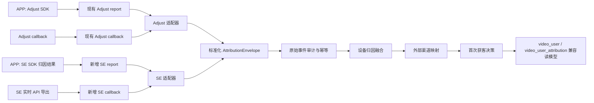

# 热力引擎归因接入与 Adjust 兼容方案

## 1. 结论

推荐把现有 Adjust 专用实现重构为“平台适配器 + 平台无关归因核心”，而不是平行复制一套 `solar_*` 服务和业务规则。

- 对外保留现有 Adjust 接口、字段和首次获客行为，避免 APP 与 Adjust 后台同时改造。
- 新增热力引擎（SolarEngine，以下简称 SE）SDK 归因快照上报和实时 API 回调接收接口。
- Adjust、SE 的原始字段先由各自适配器标准化，再进入同一套幂等、设备绑定、渠道映射、首次获客和审计流程。
- `video_user.channel_id` 与 `video_user_attribution` 继续作为兼容读模型；首次获客来源改由平台无关记录约束。
- 同一个包在任一时刻只能有一个“生效归因平台”。双平台并行期，另一个平台只落审计和设备视图，不修改用户首次获客。
- 首次获客不被再归因、拉活归因或后续切换归因平台覆盖。

本方案只描述设计和实施顺序，不执行任何数据库变更。

## 2. 文档依据

本方案参考以下热力引擎官方文档：

- [归因操作指南](https://help.solar-engine.com/cn/docs/attribution-guide)：SDK/API 接入、监测链接、回调、实时 API 数据导出及归因窗口等整体流程。
- [SDK 归因结果详情](https://help.solar-engine.com/cn/docs/attrdetail)：客户端归因结果、拉新结果、`re_data` 拉活结果和归因字段。
- [实时 API 导出](https://help.solar-engine.com/cn/docs/QG6opy)：服务端可配置的事件、归因、渠道、广告层级、设备及 `user_id` 等回调字段。
- [渠道回调配置](https://help.solar-engine.com/cn/docs/ToPEMN)：激活及后续事件、条件回传、回传数量和金额调整规则。

从官方文档可以确认：

1. SE SDK 初始化后自动上报 `install`、`startup`、`exit`，并支持 `register`、`login`、`order`、`purchase` 等事件。
2. SDK 可以返回拉新归因结果；拉活归因结果位于 `re_data`，两者不能按同一种生命周期处理。
3. 实时 API 可以把符合条件的数据发送到自定义接收地址，并允许配置字段名和值的映射。
4. 实时 API 可提供 `appkey`、`event_name`、`event_id`、`user_id`、`device_id`、`channel_id`、`channel_name`、监测链接、广告计划/广告组/素材和设备标识等字段。
5. 官方公开页面没有完整说明实时 API 的签名方式、重试次数、超时和成功响应格式，联调前需要从 SE 控制台或客户支持确认，不能在代码中假设存在某种签名协议。

## 3. 当前实现与改造范围

仓库当前已经有一套 Adjust 归因融合实现：

- APP 登录后通过 `/api/attributions/adjust/report` 上报 Adjust SDK 归因快照。
- Adjust 服务端通过 `/api/attributions/adjust/callback` 投递安装、安装更新、再归因及其他事件。
- 使用 `adid` 融合两类乱序到达的数据。
- 初次安装创建首次获客快照；`install_update` 可修正同一次首次安装；再归因只更新设备当前归因。
- 原始 callback 有幂等和审计记录。

现有方向正确，但核心类型、配置、表名和代码文件都绑定了 Adjust。直接增加 `video_solar_attribution*` 会复制以下高风险逻辑：

- 回调鉴权、载荷限制和密钥脱敏；
- 幂等键生成及乱序融合；
- 同设备绑定不同用户的冲突处理；
- 首次获客锁定与归因修正；
- 渠道、媒体映射及用户摘要写入；
- GDPR/隐私删除和原始载荷清理。

因此，本次改造范围分为两层：

- P0：SE 归因结果接收、标准化、用户融合、首次获客和 Adjust 兼容。
- P1：把注册、登录、订单、付费、订阅等业务事件抽象为平台事件适配器，按包选择上报 Adjust 或 SE。P1 不应阻塞 P0 上线。

## 4. 总体架构



外部接口按平台分开，内部规则必须共用。这样既不要求 Adjust 立刻修改配置，也不会让平台字段泄漏到用户首次获客逻辑。

## 5. 平台无关领域模型

适配器输出统一的 `AttributionEnvelope`，建议至少包含：

| 字段 | 含义 |
| --- | --- |
| `provider` | `adjust` 或 `solar_engine` |
| `app_identity` | Adjust `app_token` 或 SE `appkey`，并映射到内部 `package_code` |
| `provider_device_id` | Adjust `adid` 或 SE `device_id`/SDK distinct ID |
| `provider_event_id` | 平台提供的事件 ID；不存在时为空 |
| `event_class` | `initial_install`、`install_correction`、`reattribution`、`business_event`、`privacy_delete`、`ignored` |
| `user_id_hint` | 平台回传的用户 ID，仅作为可信回调内的匹配提示 |
| `occurred_at` | 平台事件时间 |
| `received_at` | 本服务接收时间 |
| `is_organic` | 是否自然量 |
| `touch_type` | click、impression 等 |
| `attribution_method` | referrer、deviceid、probabilistic 等 |
| `external_channel_id/name` | 平台渠道 ID、名称 |
| `tracker_id/name` | Adjust tracker 或 SE 监测链接 |
| `campaign_id/name` | 广告计划/推广计划 |
| `adgroup_id/name` | 广告组 |
| `creative_id/name` | 素材/创意 |
| `account_id` | 投放账户 |
| `device_ids` | OAID、IMEI、Android ID、GAID、IDFA、IDFV 等可用设备标识 |
| `raw_payload` | 去除鉴权密钥后的原始载荷 |

平台适配器负责字段解析、长度限制、时间格式兼容和生命周期分类；归因核心不得读取平台原始字段做业务判断。

## 6. Adjust 与 SE 字段映射

| 标准字段 | Adjust | SolarEngine |
| --- | --- | --- |
| `app_identity` | `app_token` | `appkey` |
| `provider_device_id` | `adid` | `device_id`，客户端使用 SDK distinct ID |
| `provider_event_id` | 无稳定通用值，使用规范载荷哈希 | 优先 `event_id`；为空时使用规范载荷哈希 |
| `external_channel_id` | 无 | `channel_id` |
| `external_channel_name` | `network` | `channel_name` |
| `tracker_id` | `tracker_token` | `turl_campaign_id`，必要时另存 `turl_id` |
| `tracker_name` | `tracker_name` | `turl_campaign_name` |
| `campaign_id/name` | `campaign` 主要为名称 | `adplan_id` / `adplan_name` |
| `adgroup_id/name` | `adgroup` 主要为名称 | `adgroup_id` / `adgroup_name` |
| `creative_id/name` | `creative` 主要为名称 | `adcreative_id` / `adcreative_name` |
| `touch_type` | callback 相关字段 | `attribution_touch_type` |
| `occurred_at` | `installed_at`、`reattributed_at`、`created_at` 等 | `attribution_time`、`install_time`、`current_event_time` |
| 自然量 | `network` 或 tracker 为 `organic` | `channel_id = -1` 或 `channel_name = 自然量` |
| 拉活/再归因 | `reattribution*` activity kind | SDK 结果的 `re_data`；实时 API 的实际字段需联调确认 |

注意：SE 的 `turl_campaign_*` 是监测链接，`adplan_*` 才更接近广告计划。不能把两者都压到现有 Adjust `campaign` 字段，否则后续报表无法区分监测链接和媒体投放层级。

## 7. 接口设计

### 7.1 保留 Adjust 接口

以下接口路径和请求格式保持不变：

```text
POST /api/attributions/adjust/report
GET  /api/attributions/adjust/callback
POST /api/attributions/adjust/callback
```

只把内部处理改为 `AdjustAdapter -> AttributionCore`。现有客户端、Adjust 后台配置及响应状态不应因重构发生变化。

### 7.2 新增 SE 客户端归因快照接口

```http
POST /api/attributions/solar-engine/report
Authorization: Bearer <client-jwt>
Content-Type: application/json
```

建议请求：

```json
{
  "appKey": "SE_APP_KEY",
  "deviceId": "SDK_DISTINCT_ID",
  "code": 0,
  "attributionData": {
    "channel_id": "8221",
    "channel_name": "Mintegral",
    "turl_campaign_id": "...",
    "turl_campaign_name": "...",
    "adplan_id": "...",
    "adplan_name": "...",
    "adgroup_id": "...",
    "adgroup_name": "...",
    "adcreative_id": "...",
    "adcreative_name": "...",
    "attribution_time": "2026-08-18 12:00:00",
    "install_time": "2026-08-18 11:59:30",
    "re_data": null
  }
}
```

处理规则：

- 用户 ID 只取 Bearer JWT，忽略 JSON 中任何用户 ID，规则与 Adjust 一致。
- `code = 0` 才解析归因结果。错误码由 APP 按 SE SDK 策略重试，不用把失败结果写成有效归因。
- `appKey` 必须映射到当前用户的 `package_code`，防止跨包绑定。
- `deviceId` 必填，规范化后与 `appKey` 共同作为 SE 设备身份。
- 顶层归因数据分类为拉新；`re_data` 分类为拉活，只更新设备当前视图，不覆盖用户首次获客。
- SDK 回调每次触发都可幂等上报，不能只报一次。服务端 callback 可能先到，也可能后到。

### 7.3 新增 SE 实时 API 接收接口

```text
GET  /api/attributions/solar-engine/callback
POST /api/attributions/solar-engine/callback
```

推荐 SE 后台配置为 HTTPS POST JSON。为适配后台模板能力，接收端可同时兼容：

- JSON body；
- form body；
- query 参数。

只有联调确认 SE 不支持 POST JSON 时才启用 GET 模板，避免把设备标识和归因数据长期暴露在 URL 日志中。

最低回调字段集：

```text
appkey, event_name, event_id, device_id, user_id,
attribution_time, install_time, attribution_touch_type, attribution_method,
channel_id, channel_name,
turl_campaign_id, turl_campaign_name, turl_id,
account_id, adplan_id, adplan_name,
adgroup_id, adgroup_name, adcreative_id, adcreative_name,
oaid, android_id, gaid, idfa, idfv, ipv4, ua,
current_event_time, report_time
```

回调响应建议统一为：

```json
{"code": 0, "message": "ok"}
```

最终成功响应格式和重试触发条件要以 SE 控制台联调结果为准。服务端必须做到“先持久化审计记录，再返回成功”；无法安全处理时返回非 2xx，让平台重试，而不是吞掉数据。

### 7.4 鉴权

SE 使用独立配置，不能复用 Adjust callback token：

```yaml
attribution:
  apps:
    com.example.app:
      active_provider: solar_engine
      shadow_provider: adjust
      solar_engine:
        app_key: "..."
        callback_token: "..."
        max_body_bytes: 65536
```

优先级：

1. 如果 SE 模板支持自定义 Header，使用 `X-Solar-Callback-Token`。
2. 否则使用固定 query 参数 `callback_token`。
3. 可在网关追加 SE 出口 IP 白名单，但不能只依赖 IP。

鉴权 token 必须在生成幂等键、保存 payload 和记录日志之前移除。Header 与 query 同时出现且不一致时直接返回 401。

## 8. 身份融合与首次获客规则

### 8.1 设备键

- Adjust：`(adjust, app_token, adid)`。
- SE：`(solar_engine, appkey, device_id)`。

即使 Adjust 当前以 `adid` 单列唯一，平台无关实现也应加入应用身份，避免跨应用误绑定，并使两种平台规则一致。

### 8.2 用户绑定

绑定来源按可信度排序：

1. APP 带 JWT 的 SDK 快照上报；
2. 已鉴权 SE callback 中由我方 APP SDK 设置的 `user_id`；
3. 设备表中已存在且无冲突的绑定。

任何来源都不能把同一个平台设备键从用户 A 改绑到用户 B。冲突事件进入审计状态 `conflict` 并告警，不能自动取最新值。

一个用户可以有多个设备；一个设备只能绑定一个用户。

### 8.3 首次获客

用户首次获客是平台无关的不变量：

- 第一条满足“生效平台 + 有效初装 + 渠道映射成功”的记录创建首次获客。
- Adjust `install_update` 仅可修正同一次初装。
- SE APP 快照可作为临时结果；同设备的 SE 实时 API `install` 可修正该临时结果。
- Adjust 再归因、SE `re_data` 和后续业务事件只更新设备当前归因，不修改首次获客。
- 从 Adjust 切换到 SE 后，已有用户首次获客保持不变；切换时刻之后的新用户才由 SE 生效。
- 自然量也要形成明确的首次获客记录，但不映射到付费投放渠道。

### 8.4 双平台并行

每个包配置：

- `active_provider`：允许修改用户首次获客的平台；
- `shadow_provider`：只写原始事件和设备视图，用于对账；
- `effective_at`：切换生效时间。

禁止使用“谁先到就用谁”的双平台竞争策略。两个 SDK 和服务端回调的网络延迟不同，先到顺序不代表业务优先级。

## 9. 幂等、乱序与状态机

幂等键：

- SE 优先使用 `SHA-256(provider + appkey + event_id)`。
- `event_id` 为空时，对去除密钥后的规范化 JSON 计算 SHA-256。
- Adjust 延续当前规范载荷哈希逻辑。

建议统一处理状态：

| 状态 | 含义 |
| --- | --- |
| `received` | 已完成鉴权并保存审计记录 |
| `pending_app` | 有平台回调，尚未绑定登录用户 |
| `pending_callback` | 有 APP 快照，尚无权威服务端回调 |
| `pending_mapping` | 身份已确定，外部渠道尚未映射 |
| `fused` | 设备与用户已融合 |
| `shadowed` | 非生效平台，只用于对账 |
| `ignored` | 非归因事件或无业务影响 |
| `conflict` | 用户、设备或应用身份冲突 |
| `forgotten` | 隐私删除完成 |

乱序规则：

- APP report 和平台 callback 任意顺序到达都能最终融合。
- 老事件不能覆盖较新的设备当前视图；比较标准化后的 `occurred_at`，相同时间再比较接收顺序。
- 首次获客规则独立于设备当前视图，避免新一次拉活覆盖初装。
- 渠道映射暂缺时保留 `pending_mapping`，映射补齐后可重放，不返回错误渠道。

## 10. 渠道映射

不建议继续把所有映射写在 YAML 中。SE 的 app、渠道、监测链接组合较多，应该新增可审计的映射表，并由后台管理。

建议匹配优先级：

### Adjust

1. `(app_token, tracker_token)`；
2. `(app_token, tracker_name)`；
3. 兼容现有全局 tracker 配置，作为迁移期兜底。

### SolarEngine

1. `(appkey, turl_campaign_id)`；
2. `(appkey, channel_id)`；
3. `(appkey, channel_name)` 不区分大小写精确匹配，仅作为兜底；
4. `channel_id = -1` 或 `channel_name = 自然量` 映射为 organic，不关联投放渠道。

映射结果必须同时保存外部值快照和内部 `channel_id/channel_code`，避免后来修改渠道名称影响历史归因。

## 11. 数据模型建议

### 11.1 `video_attribution_event`

平台原始事件审计表，替代平台各自的 callback 审计表：

- `provider`、`app_identity`、`provider_device_id`；
- `provider_event_id`、`event_key`；
- `event_class`、`process_status`、`process_message`；
- `user_id_hint`、`occurred_at`、`received_at`；
- 去密钥后的 `raw_payload`；
- 唯一索引 `(provider, app_identity, event_key)`。

### 11.2 `video_device_attribution`

每个平台设备的当前归因视图：

- 唯一键 `(provider, app_identity, provider_device_id)`；
- 可空 `user_id`，支持 callback 先到；
- 标准化渠道、监测链接、广告层级、触点和设备字段；
- APP 与 callback 最近载荷、时间及融合状态；
- 当前归因与首次获客是否已应用的标记。

### 11.3 `video_user_acquisition`

用户首次获客快照：

- `user_id` 唯一；
- `provider`、`device_attribution_id`、`app_identity`；
- 内部 `channel_id/channel_code`；
- 外部渠道、监测链接和广告层级快照；
- `acquired_at`、`source_event_key`；
- 是否自然量；
- 只允许同一次初装的权威修正，不允许再归因覆盖。

`video_user.channel_id` 和 `video_user_attribution` 由这张表同步，作为现有管理后台与业务代码的兼容读模型。

### 11.4 `video_attribution_channel_mapping`

- `provider`、`app_identity`；
- `external_key_type`、`external_key_value`；
- `channel_id`、`priority`、`status`；
- 唯一索引 `(provider, app_identity, external_key_type, external_key_value)`。

### 11.5 现有 Adjust 表的处理

需要在实施前确认 Adjust schema 是否已经部署：

- 若尚未部署：直接把当前未落地的 Adjust 专用 schema 调整为平台无关 schema，成本最低，不产生历史表迁移。
- 若已经部署：新增上述平台无关表，先让 Adjust 适配器双写并校验，再用版本化 SQL 回填；切换读取后保留旧表至少一个发布周期。首个版本不删除、不重命名旧表。

不建议在已部署环境原地把 `video_adjust_*` 改名为通用表，表重命名会放大上线和回滚风险。

## 12. Schema 与生成模型约束

所有数据库变更必须遵循仓库规则：

- 只通过 `scripts/schema/` 下的版本化 SQL 描述，例如从当前序号继续创建 `20260818_005_*`、`20260818_006_*`。
- 创建或修改 SQL 文件不代表允许执行；执行每个脚本前必须由用户明确确认该项变更。
- 生产 Go 代码不得包含 `AutoMigrate`、schema `Migrator` 或任何 DDL `Exec`。
- GORM Gen 字段类型、关系和生成选项只修改 `cmd/gormgen/man.go`。
- 不手工修改 `internal/gen/`；由生成器重新生成。
- 测试建表只能使用隔离的临时/内存测试数据库，禁止连接开发或生产数据库。

建议脚本拆分：

1. 创建平台无关归因表及索引；
2. 可选的 Adjust 历史数据回填；
3. 校验查询脚本；
4. 旧表清理作为未来独立变更，不纳入首发。

## 13. P1：业务事件回传兼容

归因接收与业务事件上报应解耦。建议领域层统一产生：

```text
activation, login, registration, order_created, payment, subscription
```

再由包级平台适配器转换：

| 内部事件 | Adjust | SolarEngine |
| --- | --- | --- |
| `activation` | SDK install/归因生命周期处理 | SDK 自动 `install`，无需重复手工上报 |
| `login` | 对应 Adjust event token | 预定义 `login` |
| `registration` | 对应 Adjust event token | 预定义 `register` |
| `order_created` | 对应 Adjust event token | 预定义 `order` |
| `payment` | revenue event | 预定义 `purchase`，带 order ID、金额、币种 |
| `subscription` | 独立 event token | 自定义事件或经确认的预定义方案 |

金额使用十进制定点值和 ISO 4217 币种，不能复用 Adjust 当前允许 `NaN` 的原始成本字段。

`video_channel.callback_config` 中的扣量、次数和金额规则可以继续作为业务规则来源，但最终发送必须经过 provider adapter，不能在订单/登录服务里直接调用某个平台 SDK/API。

## 14. 安全、隐私与可观测性

### 安全

- callback token 分平台、分环境，至少 32 字节随机值；禁止写入日志和原始载荷。
- 限制 body 大小、字段长度、嵌套深度和允许的 content type。
- `appkey/app_token` 必须在允许列表中，并绑定 `package_code`。
- 不根据 callback 里的任意 `user_id` 创建用户，只匹配已存在用户。
- 管理后台展示 OAID、IMEI、IDFA 等字段时默认脱敏并受权限控制。

### 隐私删除

Adjust 的 `gdpr_forget_device` 继续支持。SE 官方参考页面没有给出等价回调，需接入统一的内部隐私删除入口：按 `(provider, app_identity, provider_device_id)` 清除设备视图和原始 payload，同时保留法律/财务允许保留的最小化渠道快照。具体保留范围由隐私政策确认。

### 指标

至少增加：

- `attribution_callback_total{provider,status}`；
- `attribution_callback_latency_seconds{provider}`；
- `attribution_pending_total{provider,reason}`；
- `attribution_conflict_total{provider,type}`；
- `attribution_mapping_miss_total{provider,app}`；
- `attribution_first_acquisition_total{provider,organic}`；
- 双平台 `channel_match_rate`、`install_time_delta` 和 organic 差异率。

日志只记录 `event_key`、provider、app、处理状态和脱敏设备 ID，不记录完整设备标识或 token。

## 15. 实施阶段

### 阶段 0：联调确认

- 从 SE 测试应用导出一份真实 SDK attributionData。
- 从实时 API 发送一份真实 `install` 和一份后续事件样例。
- 确认 HTTP method、content type、自定义 Header、成功响应、超时和重试策略。
- 确认 APP 是否会设置 SE `user_id`，以及 SDK distinct ID 的获取与重置规则。
- 确认 `re_data` 或实时 API 中拉活事件的实际字段。

### 阶段 1：平台无关核心

- 提取标准化 envelope、状态机、幂等、融合、渠道映射和首次获客服务。
- Adjust adapter 接入新核心，保持现有接口回归通过。
- 根据 schema 是否已部署选择“部署前重整”或“新增表 + 双写回填”。

### 阶段 2：SE P0 接入

- 增加 SE 配置、APP report 和实时 API callback handler。
- 增加 SE adapter、时间/字段解析、`re_data` 分类和 organic 判断。
- APP 接入 SE SDK，登录后设置 `user_id`，并上报 distinct ID 与 SDK 归因快照。
- 管理后台增加 SE 渠道映射和 pending/conflict 查询。

### 阶段 3：影子对账

- 单个测试包保持 Adjust 为 active，SE 为 shadow，运行 3 至 7 天。
- 对比安装量、自然量比例、渠道匹配率、归因时间、广告层级完整率。
- 对 mapping miss、用户冲突和乱序积压逐条清零。

### 阶段 4：灰度切换

- 配置明确的 `effective_at`，新用户首次获客由 SE 生效。
- Adjust 保持 shadow 和回滚能力至少一个发布周期。
- 不回写或重算切换前已有用户首次获客。

### 阶段 5：P1 事件适配

- 统一业务事件领域模型。
- 为 Adjust、SE 分别实现 event adapter。
- 对订单号、金额、币种、重试和幂等做端到端验收。

## 16. 测试与验收标准

### 单元测试

- Adjust 与 SE 字段标准化和长度限制；
- SE `event_id` 幂等及无 event ID 时的规范载荷哈希；
- 多种时间格式、时区和毫秒时间戳；
- organic 判断；
- `re_data` 不覆盖首次获客；
- 渠道映射优先级；
- token 恒定时间比较及密钥移除。

### 集成测试

- callback 先到、APP report 后到；
- APP report 先到、callback 后到；
- 相同 callback 重试多次只处理一次；
- 同用户多设备成功；
- 同设备绑定不同用户进入 conflict；
- callback 中 app 与用户 package 不一致时拒绝融合；
- 映射缺失进入 pending，补充映射后重放成功；
- Adjust `install_update` 可修正初装，reattribution 不覆盖首次获客；
- SE 权威 install 可修正同设备临时 SDK 快照，`re_data` 不覆盖首次获客；
- active/shadow 切换时只有 active provider 能写用户摘要；
- 隐私删除不遗留原始设备 payload。

### 回归验收

- 现有 Adjust 三个接口路径、鉴权方式和主要响应不变。
- 现有 Adjust 测试全部通过。
- 管理后台现有用户归因列表仍能读取 `video_user_attribution`。
- 未执行 schema 时应用不会自行建表或改表。
- SE callback 在目标吞吐下 P95 响应时间满足平台超时要求。
- 灰度期间 SE 与 Adjust 的有效安装差异处于业务确认的阈值内。

## 17. 回滚方案

- 配置把 `active_provider` 切回 Adjust，不回滚或覆盖已经锁定的首次获客。
- 暂停 SE callback 处理时仍可先保存审计事件，恢复后重放。
- 新表为新增式设计，首发不删除旧 Adjust 表；代码回滚不依赖反向 DDL。
- 若 SE 数据质量异常，将 SE 改为 shadow，继续采集和排查，不让其写用户摘要。
- schema 回滚必须是单独版本化 SQL 并再次取得明确执行授权。

## 18. 实施前必须确认的问题

1. 当前 Adjust 相关 schema 是否已经在任何环境执行；这决定采用部署前重整还是新增表迁移。
2. SE 实时 API 是否支持 POST JSON、自定义 Header、固定 query 参数及其重试/成功响应规则。
3. APP 技术栈和 SE SDK 版本，以及获取 distinct ID、设置 `user_id` 的准确 API。
4. 一个 `video_user` 是否永远只属于一个 `package_code`；若存在跨包共享账号，首次获客唯一键要调整为 `(user_id, package_code)`。
5. 拉活归因是否需要展示和分析，还是仅保留设备当前视图。
6. 首发是否只接收 `install`，还是同时接收 `register/login/order/purchase` 实时 API 事件。
7. SE 与 Adjust 影子对账的允许差异阈值和灰度包范围。

